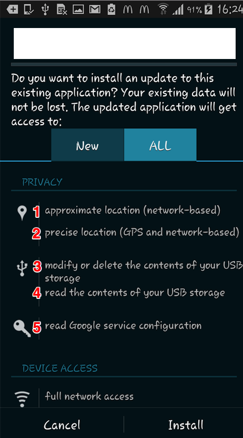
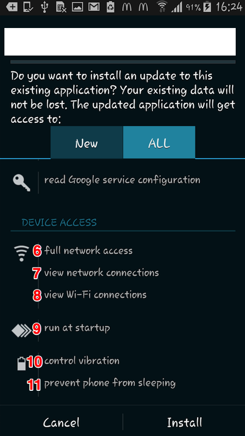

#Android APP Privilege Checking Report

###Reported by Cao Lei (Tony) on 04.11.2015

According to the request of market's manager, I did some checking about our Android app's DEVICE ACCESS and PRIVACY items.

These are two screenshots about installing HK STG APP:  

 

Settings are found in global configuration file of Android:

    <uses-permission android:name="android.permission.ACCESS_COARSE_LOCATION" />  -  1
    <uses-permission android:name="android.permission.ACCESS_FINE_LOCATION" />  -  2
    <uses-permission android:name="android.permission.WRITE_EXTERNAL_STORAGE" />  -3
    <uses-permission android:name="android.permission.READ_EXTERNAL_STORAGE" />  -4
    <uses-permission android:name="com.google.android.providers.gsf.permission.READ_GSERVICES" />  -5
    <uses-permission android:name="android.permission.INTERNET" />  -  6
    <uses-permission android:name="android.permission.ACCESS_NETWORK_STATE" />  -  7
    <uses-permission android:name="android.permission.ACCESS_WIFI_STATE" />  -  8
    <uses-permission android:name="android.permission.VIBRATE" />  - 10
    <uses-permission android:name="android.permission.WAKE_LOCK" />  - 11

>Note: WAKE_LOCK	Allows using PowerManager WakeLocks to keep processor from sleeping or screen from dimming.

These settings below are about the item 9 in image:  Found these settings in Vmob configuration file:
   	
On a device boot the app needs to download geo-fences again as they would have been lost when the device was shut down:
   	   		
    <uses-permission android:name="android.permission.RECEIVE_BOOT_COMPLETED" /> - 9
    

If you want to reference all the permission settings of Android:
http://developer.android.com/reference/android/Manifest.permission.html