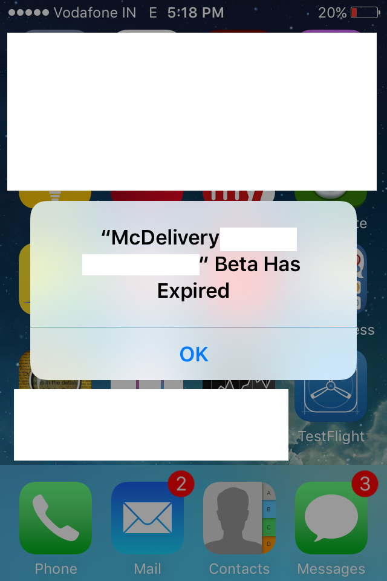

##iOS Beta Expired

https://tengi.zendesk.com/hc/en-gb/community/posts/201309972-iOS-Beta-Expired-What-does-this-mean-

Hi!  Firstly, the beta hasn't expired!  Don't worry!

Testflight, the app we have to use to manage the beta test, only allows each "build" of the iOS app to work for 30 days.  Once this period has expired, you'll see an error messaging telling you the beta has expired.  

If you see this error message, you need to go into test flight and you should see a button to download the new version of the app.  This will enable you to get back into Tengi, and will mean you are running on the newest version with all our recent bug fixes in.  Don't worry, you won't lose your tickets!

Once we go live, this won't happen!

##---> Actually,
 it caused by Certificates expired----> Market renew the account and then this account is reset somehow. All the previous Certificates are gone. Then all the related provisioning profiles are invalid.
 
 