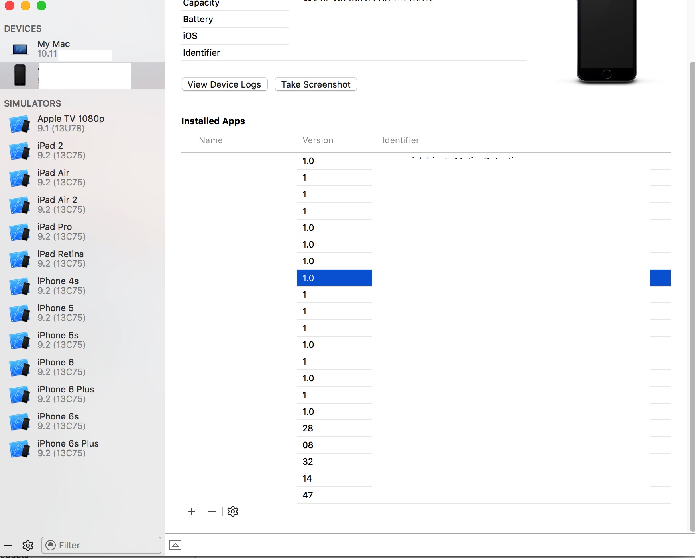

# App installation failed due to application-identifier entitlement

http://stackoverflow.com/questions/32677133/app-installation-failed-due-to-application-identifier-entitlement

##Issue:  
Full error:

App installation failed

This application's application-identifier entitlement does not match that of the installed application. These values must match for an upgrade to be allowed.
This is running the app in debug mode on a physical device. Running just the iOS app works fine.

I have turned App Groups off again and removed the entitlements files that were added, but same error.

##Solution:  
I had this problem with an iPhone app, and fixed it using the following steps.

With your device connected, and Xcode open, select Window->Devices
In the left tab of the window that pops up, select your problem device	
In the detail panel on the right, remove the offending app from the "Installed Apps" list.	
After I did that, my app rebuilt and launched just fine. Since your app is a watchOS app, I'm not sure that you'll have the same result, but it's worth a try.	

