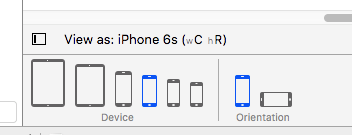

#Simulated Metrics “Orientation” dropdown missing

The Orientation option has been removed. You may access devices by size and orientation at the bottom of the Standard Editor View. This is not reflected in the Xcode documentation.

