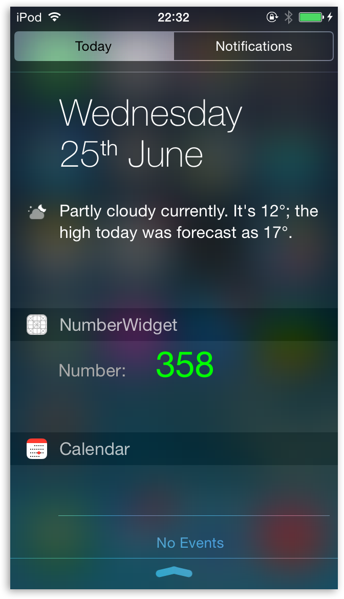
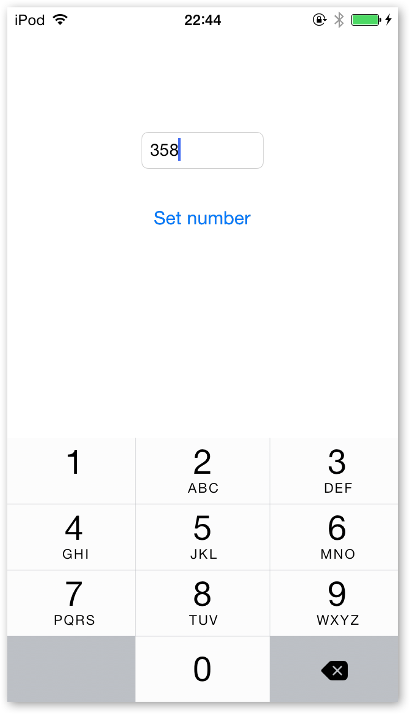

TodayExtensionSharingDefaults
=============================

As the name suggests, this is a sample iOS 8 Today extension which shares data with its containing app using NSUserDefaults.

For detailed step-by-step tutorial, check out this <a href="http://www.glimsoft.com/06/28/ios-8-today-extension-tutorial/">blog post</a>.

If you have any questions, use the comments section on the blog or contact me on Twitter <a href="http://twitter.com/luksape" target="_blank">@luksape</a>.

 

	(1) It is only available in IOS 8.
	(2) In order to see the information posted by our App, users need to do these following things first:
	-Users need to open the Today View panel 
	-Click 'Edit'
	-Find our app and click "+" icon to add it to today view.
	The video about this steps: https://youtu.be/q4A7mKiHedI

http://stackoverflow.com/questions/28007290/this-app-contains-an-app-extension-with-an-illegal-bundle-identifier-issue

	error
	
	app Info.plist: com.company.product.$(PRODUCT_NAME:rfc1034identifier)
	ext Info.plist: com.company.product.$(PRODUCT_NAME:rfc1034identifier)
	So I ended up with
	
	app Info.plist: com.company.product.product
	ext Info.plist: com.company.product.product_ext
	which passed the build checks but refused to run on a device with error:
	
	This app contains an app extension with an illegal bundle identifier. App extension bundle identifiers must have a prefix consisting of their containing application's bundle identifier followed by a '.'.
	Once I removed the extra product, the build ran on a device.
	
	correct
	
	app Info.plist: com.company.$(PRODUCT_NAME:rfc1034identifier)
	ext Info.plist: com.company.product.$(PRODUCT_NAME:rfc1034identifier)
	
	app Info.plist: com.company.product
	ext Info.plist: com.company.product.product_ext
	I discovered my error when I accidentally changed the application Info.plist instead of the extension Info.plist. To aid in debugging the problem, introduce an error into the application Info.plist, and you should get a build error with the Bundle identifier of the app and extension:
	
	 ERROR.com.myname.myappname
