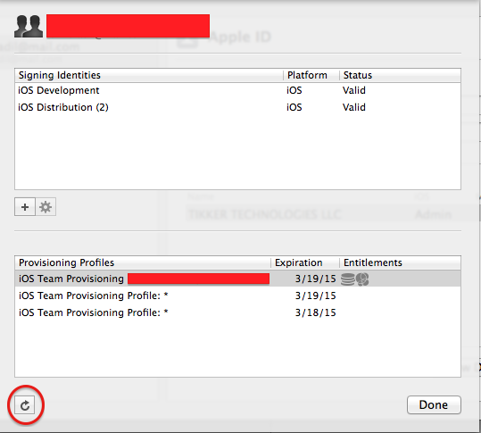

#Add device to auto-generated Xcode 5 provisioning profile

http://stackoverflow.com/questions/19134000/add-device-to-auto-generated-xcode-5-provisioning-profile

This is what worked for me:

Go to Apple development portal and add the device (UDID) as you normally do. Till now the UDID is not added to your provisioning profile.

In Xcode, go to project settings and select Add an Account from the Team dropdown.

enter image description here

A dialog will pop up. Just press Cancel. (if xCode automatically generated Profiles that means you'd already have the account setup. You don't need to add a new account)

Now from left side, select the Apple account this project belongs to.

Click View Details

Now just click the refresh button at the bottom left side of the window.

enter image description here

It will take some time to refresh, but when it finishes, the UDID will be added to your X-Code generated Provisioning Profile.