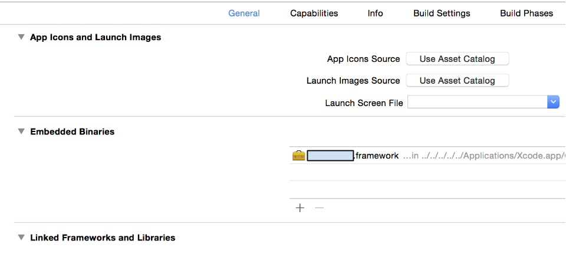

#dyld: Library not loaded … Reason: Image not loaded

http://stackoverflow.com/questions/17703510/dyld-library-not-loaded-reason-image-not-loaded

In the target's General tab, there is an Embedded Binaries field.

add required framework and crash is resolved.

