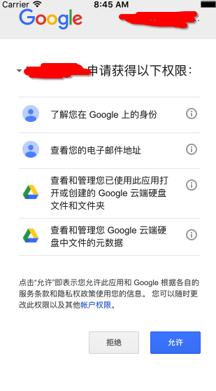

#google drive permission

http://www.ceus-now.com/how-can-i-give-full-permissions-to-google-drive-rest-api/

	// Creates the auth controller for authorizing access to Drive API.
	- (GTMOAuth2ViewControllerTouch *)createAuthController {
	    GTMOAuth2ViewControllerTouch *authController;
	    // If modifying these scopes, delete your previously saved credentials by
	    // resetting the iOS simulator or uninstall the app.
	    NSArray *scopes = [NSArray arrayWithObjects:kGTLAuthScopeDriveFile, nil];
	    authController = [[GTMOAuth2ViewControllerTouch alloc]
	                      initWithScope:[scopes componentsJoinedByString:@" "]
	                      clientID:kClientID
	                      clientSecret:nil
	                      keychainItemName:kKeychainItemName
	                      delegate:self
	                      finishedSelector:@selector(viewController:finishedWithAuth:error:)];
	    return authController;
	}
	
	
	
	// Authorization scope
	NSString * const kGTLAuthScopeDrive                 = @"https://www.googleapis.com/auth/drive";
	NSString * const kGTLAuthScopeDriveAppdata          = @"https://www.googleapis.com/auth/drive.appdata";
	NSString * const kGTLAuthScopeDriveFile             = @"https://www.googleapis.com/auth/drive.file";
	NSString * const kGTLAuthScopeDriveMetadata         = @"https://www.googleapis.com/auth/drive.metadata";
	NSString * const kGTLAuthScopeDriveMetadataReadonly = @"https://www.googleapis.com/auth/drive.metadata.readonly";
	NSString * const kGTLAuthScopeDrivePhotosReadonly   = @"https://www.googleapis.com/auth/drive.photos.readonly";
	NSString * const kGTLAuthScopeDriveReadonly         = @"https://www.googleapis.com/auth/drive.readonly";
	NSString * const kGTLAuthScopeDriveScripts          = @"https://www.googleapis.com/auth/drive.scripts";

kGTLAuthScopeDriveFile is the full permisson for reading and writing the file in the google drive.

kGTLAuthScopeDriveMetadata is the full permission to see other files created by users except for creating by this program.

You can have more than one permission types at the same time:

  NSArray *scopes = [NSArray arrayWithObjects:kGTLAuthScopeDriveFile,kGTLAuthScopeDriveMetadata, nil];
  
  
