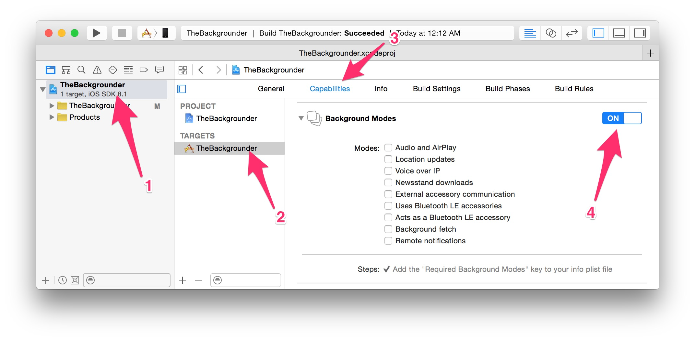

# allowsBackgroundLocationUpdates in CLLocationManager in iOS9

http://stackoverflow.com/questions/30808192/allowsbackgroundlocationupdates-in-cllocationmanager-in-ios9

allowsBackgroundLocationUpdates in CLLocationManager in iOS9

<key>NSLocationAlwaysUsageDescription</key>
<string>I want to get your location Information in background</string>

<key>UIBackgroundModes</key>
<array>
    <string>location</string>
</array>

